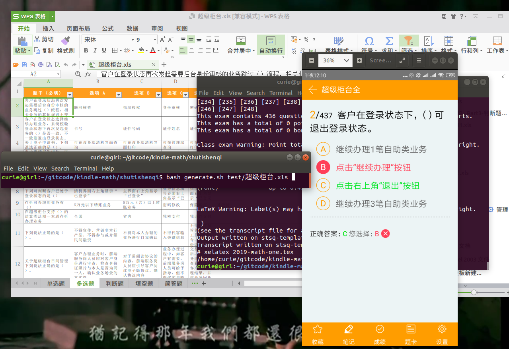
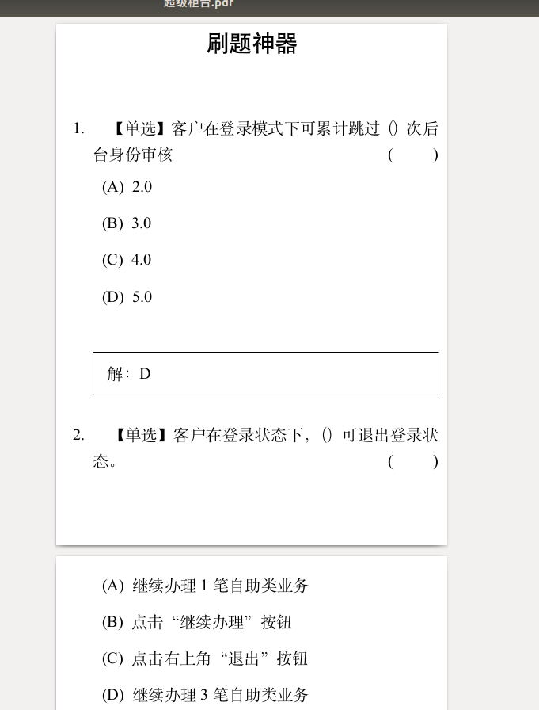

# multiple-choice-kindle
[“刷题神器”](https://stsq.tibosi.com/)

## 本项目功能
"刷题神器"支持安卓、ios和小程序做题，只要按照其格式将题目导入excel模板中并上传，即可在手机上随时做题。
本项目通过读取此种类型表格，将题目自动排版成适合kindle阅读的pdf,因此它也可以看成是刷题神器的社区版导出功能。这样更加方便学习各类多选、单选、判断题库。
### 使用方法
例如设超级柜台.xls为满足刷题神器格式的excel表，则使用方法：
```sh
$ bash generate.sh test/超级柜台.xls 
```
本项目用到的排版相关的项目：
[kindle-math](https://github.com/Twopothead/kindle-math)
使用截图：


生成适合kindle阅读的pdf效果图：



